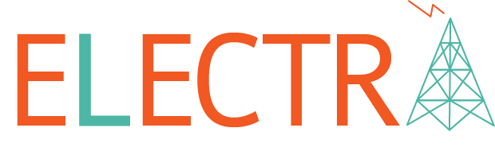

## Get Your Sh*t Together

This week we worked on organizing our project. At the beginning of the week, we were scattered and lacked a clear direction. One thing we learned is that it's important to take the time to plan. While it might seem slow at first, planning can actually save you time in the future. It was difficult to get everyone on the same page, but it was worth it when everything came together.

Our group is good at generating ideas, so we have an effective brainstorming workflow. However, when it comes to being decisive, our workflow is not as effective. I'm good at being decisive when the time comes, but I need to work on listening to my teammates. I don't want to stifle their voices for the sake of meeting deadlines.

## Logo Design

When the logo came together, it was the most satisfying moment of the week. Check it out:

